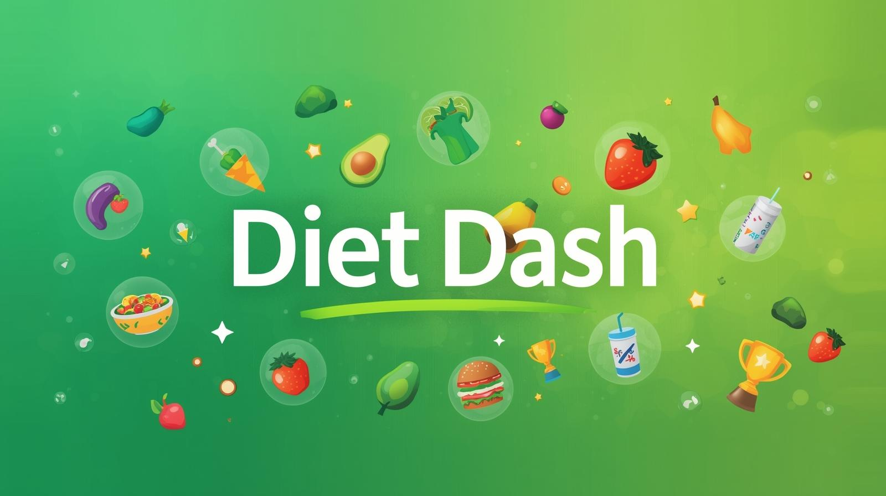
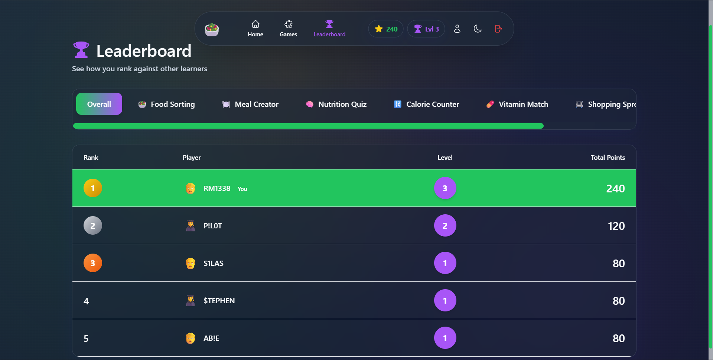
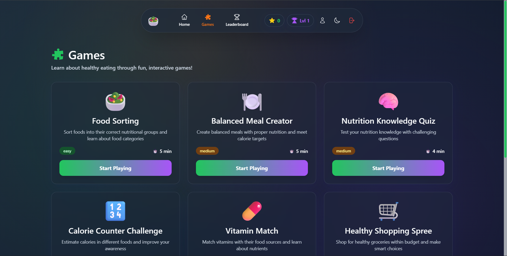

# 🥗 Diet Dash - Gamified Nutrition Learning Platform



<div align="center">
  


**A modern, interactive web application that makes learning about nutrition fun and engaging through gamification.**

[Features](#-features) • [Demo](#-demo) • [Installation](#-installation) • [Tech Stack](#-tech-stack) • [Project Structure](#-project-structure)

---

</div>

## 📸 Demo

<div align="center">

### Dashboard & Games
  
| Dashboard | Nutrition Quiz |
|:---------:|:---------:|
|  |  |

### Gameplay in Action


</div>

## ✨ Features

### 🎮 Interactive Games
- **6 Nutrition Games** - Food Sorting, Meal Creator, Nutrition Quiz, Calorie Counter, Vitamin Match, Shopping Spree
- **Educational Content** - Learn about nutrition through fun, interactive challenges
- **Real-time Feedback** - Instant scoring and educational tips during gameplay

### 🏆 Gamification System
- **Points & Levels** - Earn points and level up as you complete challenges
- **Badges & Achievements** - Unlock special badges for milestones
- **Leaderboards** - Compete with friends and track global rankings
- **Progress Tracking** - Monitor your learning journey with detailed statistics

### 👥 Multi-Role Support
- **Student Accounts** - Play games, track progress, earn rewards
- **Teacher Accounts** - Monitor student progress, assign challenges
- **Parent Accounts** - View child's learning progress and achievements

### 🎨 Modern Design
- **Glassmorphic UI** - Beautiful translucent interface with modern aesthetics
- **Dark/Light Theme** - Toggle between themes for comfortable viewing
- **Responsive Design** - Works seamlessly on desktop, tablet, and mobile
- **Smooth Animations** - Engaging transitions and interactive elements

### 🔒 Security Features
- **JWT Authentication** - Secure token-based authentication system
- **Bcrypt Encryption** - Password hashing for user security
- **Role-based Access** - Protected routes based on user roles

## 🛠️ Tech Stack

### Frontend
- **React.js 18** - Modern UI library with functional components
- **React Router** - Client-side routing
- **Context API** - State management
- **Axios** - HTTP client for API calls
- **Tailwind CSS** - Utility-first CSS framework
- **Heroicons** - Beautiful hand-crafted SVG icons

### Backend
- **Node.js** - JavaScript runtime
- **Express.js** - Web application framework
- **MongoDB** - NoSQL database
- **Mongoose** - MongoDB object modeling
- **JWT** - JSON Web Tokens for authentication
- **Bcrypt** - Password hashing

## ⚡ Getting Started

### Prerequisites
- **Node.js** (v14 or higher)
- **MongoDB** (local installation or MongoDB Atlas account)
- **npm** or **yarn**

### Installation

#### Clone the Repository
```bash
git clone https://github.com/RM1338/diet-dash.git
cd diet-dash
```

#### Backend Setup
```bash
# Navigate to server directory
cd server

# Install dependencies
npm install

# Create .env file
touch .env
```

Add the following to your `.env` file:
```env
PORT=5000
MONGODB_URI=your_mongodb_connection_string
JWT_SECRET=your_jwt_secret_key
```

```bash
# Start backend server
npm start
```

#### Frontend Setup
```bash
# Navigate to client directory (in a new terminal)
cd client

# Install dependencies
npm install

# Start frontend development server
npm start
```

The application will open at `http://localhost:3000`

### Building for Production
```bash
# Build frontend
cd client
npm run build

# Deploy backend
cd ../server
npm run start
```

## 📁 Project Structure

```
diet-dash/
├── client/                        # React frontend
│   ├── public/
│   │   ├── index.html
│   │   └── assets/
│   ├── src/
│   │   ├── components/            # Reusable UI components
│   │   │   ├── Navbar.jsx
│   │   │   ├── GameCard.jsx
│   │   │   ├── Leaderboard.jsx
│   │   │   └── ProgressBar.jsx
│   │   ├── pages/                 # Page components
│   │   │   ├── Dashboard.jsx
│   │   │   ├── Games.jsx
│   │   │   ├── Profile.jsx
│   │   │   └── Login.jsx
│   │   ├── context/               # Context providers
│   │   │   ├── AuthContext.jsx
│   │   │   └── ThemeContext.jsx
│   │   ├── services/              # API services
│   │   │   └── api.js
│   │   ├── utils/                 # Utility functions
│   │   ├── App.jsx
│   │   └── index.jsx
│   └── package.json
│
├── server/                        # Node.js backend
│   ├── models/                    # MongoDB models
│   │   ├── User.js
│   │   ├── Game.js
│   │   └── Achievement.js
│   ├── routes/                    # API endpoints
│   │   ├── auth.js
│   │   ├── games.js
│   │   └── users.js
│   ├── middleware/                # Custom middleware
│   │   └── auth.js
│   ├── config/                    # Configuration files
│   │   └── db.js
│   ├── controllers/               # Route controllers
│   ├── server.js                  # Entry point
│   └── package.json
│
├── githubAssets/                  # README assets
│   ├── banner.png
│   ├── dashboard.png
│   ├── quiz.png
│   └── gameplay.gif
│
├── .gitignore
├── README.md
└── LICENSE
```

## 🎯 Game Descriptions

### 1. Food Sorting
Drag and drop foods into correct nutritional categories. Learn about food groups and their health benefits.

### 2. Meal Creator
Build balanced meals by selecting foods from different groups. Get feedback on nutritional completeness.

### 3. Nutrition Quiz
Answer multiple-choice questions about nutrition facts, vitamins, and healthy eating habits.

### 4. Calorie Counter
Estimate calories in meals and learn about portion control and energy balance.

### 5. Vitamin Match
Match vitamins with their food sources and learn about their health benefits.

### 6. Shopping Spree
Make healthy choices while grocery shopping within a budget. Learn to read nutrition labels.

## 🎨 Customization

### Changing Theme Colors
Edit `client/src/styles/theme.js`:
```javascript
export const theme = {
  light: {
    primary: '#22D3EE',
    secondary: '#64748B',
    background: '#F4F4F4'
  },
  dark: {
    primary: '#22D3EE',
    secondary: '#64748B',
    background: '#0F172A'
  }
}
```

### Adding New Games
1. Create game component in `client/src/components/games/`
2. Add game route in `App.jsx`
3. Create game model in `server/models/`
4. Add game endpoints in `server/routes/games.js`

### Modifying Point System
Edit `server/config/points.js`:
```javascript
export const POINTS = {
  GAME_COMPLETION: 100,
  PERFECT_SCORE: 50,
  DAILY_BONUS: 25,
  STREAK_BONUS: 10
}
```

## 🐛 Known Issues

- Some animations may lag on older mobile devices
- Leaderboard refresh rate limited to prevent server overload
- File upload for avatars currently limited to 2MB

## 🚀 Future Enhancements

- [ ] AI-powered personalized nutrition recommendations
- [ ] Weekly nutrition challenges and events
- [ ] Social features (friend invites, team competitions)
- [ ] Mobile app (React Native version)
- [ ] Integration with fitness trackers
- [ ] Multilingual support
- [ ] Offline mode for games
- [ ] Parent/teacher dashboard analytics
- [ ] Custom avatar creator
- [ ] Recipe sharing community

## 🤝 Contributing

Currently not accepting contributions (college project). Feel free to fork and experiment!

## 📝 License

This project is licensed under the **MIT License** - see the [LICENSE](LICENSE) file for details.

## 🙏 Acknowledgments

- **Google Cloud** - Infrastructure and hosting support during hackathon
- **GeeksforGeeks** - Hackathon organizer (Digital Campus 2.0 Hack Sprint)
- **Karunya Institute of Technology and Sciences** - Academic guidance and support
- **React Community** - Amazing documentation and resources
- **Nutrition.gov** - Educational content and nutritional data

## 📧 Contact

**Ronel Abraham Mathew** - [@RM1338](https://www.linkedin.com/in/ronelm/)

**Email:** rma80070@gmail.com

**Project Link:** [https://github.com/RM1338/diet-dash](https://github.com/RM1338/diet-dash)

---

<div align="center">
  
Made with ❤️ and lots of 🥗

If you found this project helpful, consider giving it a ⭐!

**Qualified for Round 2 - Digital Campus 2.0 Hack Sprint**

</div>